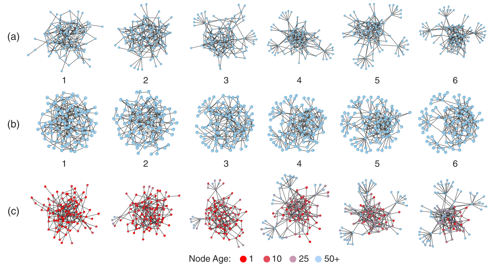
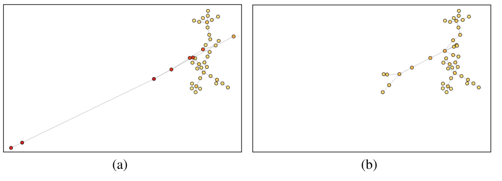
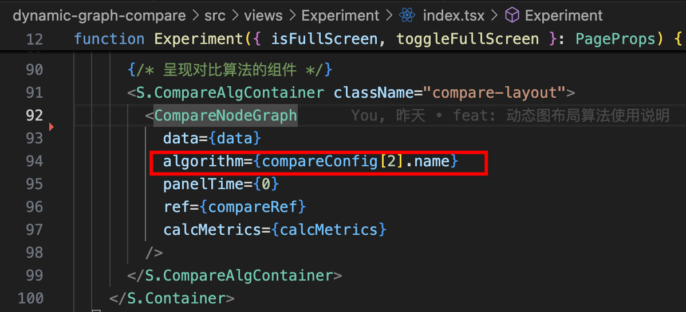
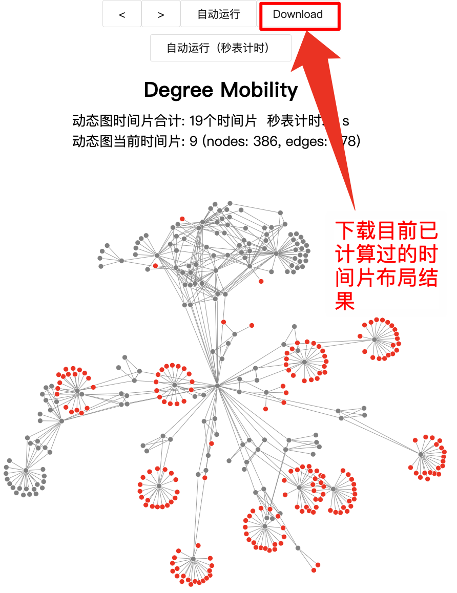
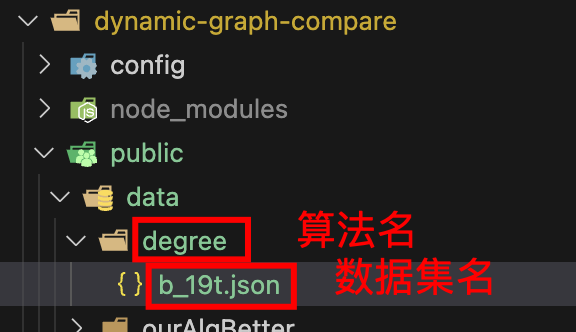
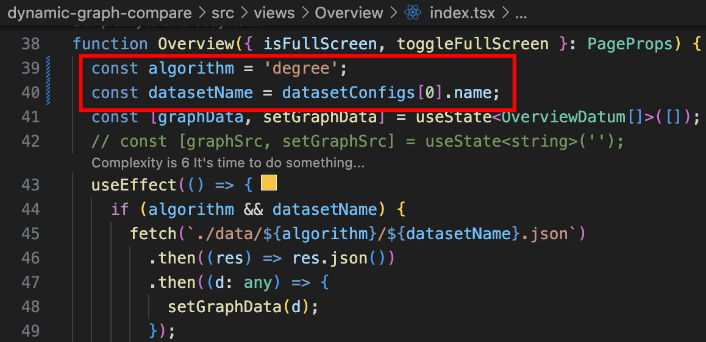
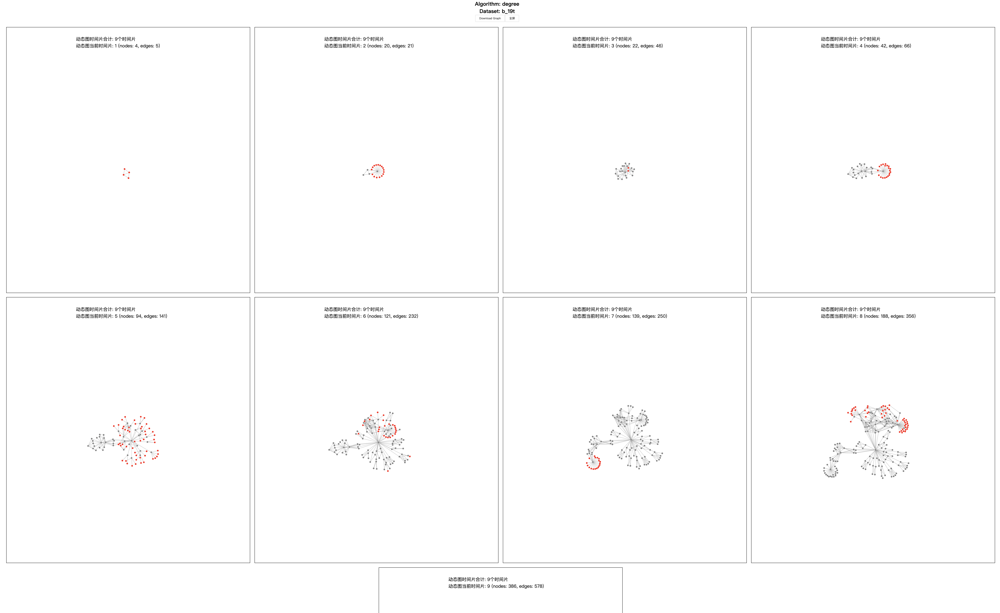

# 场景

动态图布局方法是一种能够展示网络结构随时间变化的可视化技术动态图布局方法通常分为离线动态图布局方法和在线动态图布局方法，离线动态图布局是指在网络变化数据已知的情况下对图进行布局，而在线动态图布局情况则需要通过实时接收新的网络数据来调整图布局效果。通常来说，在线动态图布局方法可以用于离线动态图布局中，所以在线动态图布局也具有更广阔的研究背景。

由于不能提前知道所有的动态图数据，因此在线动态网络需要实时计算前后两个时间片数据的差异，维持连续多个时间片的图布局结构的一致性和连续性，减少用户的认知负担和视觉干扰。由于动态网络图布局过程首先需要选择一个静态图布局方法为基础，而不同的静态图布局方法在维持用户心理地图的策略不同。

本工程所用的四个动态网络布局算法的静态图布局算法均基于弹簧-电荷力模型，采取限制节点移动策略，即通过节点的度数、节点存在的时间片数等特征，限制节点的移动能力，从而在保证布局美观性的同时尽可能减少相邻时间片的布局视觉差异。

为了限制相同节点在相邻时间片的移动能力，Gorochowski等人提出了基于节点年龄的动态图布局方法，考虑了历史时间片节点位置对当前时间片节点位置的影响。其效果如图2-2所示，节点在起初出现时，年龄被定义为0，之后每存在一个时间片，年龄就会增长，增长的幅度会受到节点周围邻居结构是否变化影响，如果节点邻居没有改变，那么年龄就会增长较多，反之则增长较少。在布局计算中，年龄越大的节点移动能力越弱，位移程度也就越小。



<p style="text-align: center;">图2-2 Age年龄算法</p>

但这类限制节点移动的方法会因节点移动受限出现长连边的问题，为了解决该问题，Crnovrsanin等人提出了一种基于子图划分和子图合并的增量式策略来处理长连边，该方法借用层级粗划和细化的思路，能够有效减少节点之间出现长连边的问题，如图2-3所示。



<p style="text-align: center;">图2-3 Crnovrsanin 子图合并算法示意图</p>

# 使用说明

前端环境：node v18及以上

```
pnpm i # 安装依赖
pnpm start # 启动工程
```

# 路由

## /overview

提供某个算法在某个数据集下的所有时间片的概览gallery

功能包括：

1. 导出gallery png

## /experiment

提供算法在某个数据集下的运行表现图

功能包括：

1. 单步时间片切换
2. 自动运行单个算法
3. 自动运行所有算法
4. 下载某个时间片的数据集（可用于overview）
5. 计算单时间片指标如DCQ
6. 实时秒表计时
7. 实时图规模统计

# 对比算法运行流程

1. src/compare 对比算法，基于**G6自定义图布局**实现并注入

   1. **alg 具体的布局算法，如age、degree**
   2. **forces 各种限制力**
   3. **pos 初始化节点位置**
   4. **layout 最终暴露出来布局入口，可以配置布局算法和限制力策略，并注入到G6自定义布局策略中**
   5. **simulation 力模拟器**

2. src/component 封装图渲染组件，支持多种交互

   **其中，渲染对比图的组件内，使用layout的方式如下：**

   1. **初始化一个G6图实例，type为我们刚注入到自定义布局**
   2. **切换时间片的时候，给图实例传入新旧时间片的点边，然后初始化位置，接着应用对比算法，最后在G6中开启力模拟器计算**
   3. **布局计算完毕的回调事件内，更新图中节点和连边，计算各种布局指标**

3. src/metrics 各种衡量动态图布局质量的指标

4. src/router 路由配置文件

5. src/config 图布局参数配置、样式配置

# 效果


# 具体使用

## Experiment视图怎么切换算法

更换传入的算法名称即可，比如更改为compareConfig[0].name或直接输入对应的字符串




## 怎么一次性呈现某个算法在某个数据集上的运行效果gallery

### 1.运行到某个感兴趣的时间片时，下载已经计算过的时间片的布局结果




### 2.将下载后的数据根据所用算法和数据集名称放入对应的data/overview文件夹中



### 3.修改Overview中读取的数据路径



### 4.浏览器输入http://localhost:3000/overview查看gallery



### 5.下载gallery整图


# 进阶——如何实现一个基于G6的自定义力导引布局

可参考src/compare目录下的源代码理解如下概念

## 1.定义各种力

如节点距离力，必须实现initialize方法用来初始化节点/连边，返回一个force

## 2.定义力模拟器

必须实现：

1. tick接口，用于每次迭代计算
2. nodes接口，用于传入模拟计算的节点集合
3. stop接口，用于暂停力模拟器
4. restart接口，用于重启力模拟器
5. alpha和alphaDecay接口，用于定义“退火衰减次数”即迭代计算次数

## 3.定义布局方法

1. 初始化配置参数
2. 读取图数据，初始化点边
3. 执行布局计算：
   1. 开启力模拟器
   2. 力模拟器中应用各种力
   3. 按需添加自定义力，比如约束力
4. 更新布局参数
5. 终止布局并销毁

## 4.注册布局到G6

```
registerLayout('restricted-force-layout', RestrictedForceLayout);
```