# 使用说明

前端环境：node v18及以上

```
pnpm i # 安装依赖
pnpm start # 启动工程
```

# 路由

## /overview

提供某个算法在某个数据集下的所有时间片的概览gallery

功能包括：

1. 导出gallery png

## /experiment

提供我们的算法在某个数据集下的运行表现图

功能包括：

1. 单步时间片切换
2. 自动运行单个算法
3. 自动运行所有算法
4. 下载某个时间片的数据集（可用于overview）
5. 计算单时间片指标如DCQ
6. 实时秒表计时
7. 实时图规模统计

# 运行流程

1. **public/html 中注入wasm依赖文件——calcNode.js和calcNode.wasm（C++部分优化后，直接替换编译后的wasm文件即可）**

2. **src/algorithm 向外暴露DynamicGraph类，用来开启worker线程，在后台用wasm开启计算线程，通过postMessage与主线程通信**

3. **src/worker 作为主线程，用来和子线程通信，接受各个时间片的图布局计算结果**

4. **src/store 存储每个时间片内的图点边数据**

5. **src/component 封装图渲染组件，支持多种交互**

   **其中，我们的图组件内，使用布局算法的方式如下**

   1. **传入一个DynamicGraph实例开启worker子线程计算下一时间片点边数据**
   2. **切换时间片时将数据存入store**
   3. **监测到store内数据发生变化时，图组件内节点和连边数据随之变化，并且重新计算指标**

6. src/metrics 各种衡量动态图布局质量的指标

7. src/router 路由配置文件

8. src/config 图布局参数配置、样式配置

# 效果

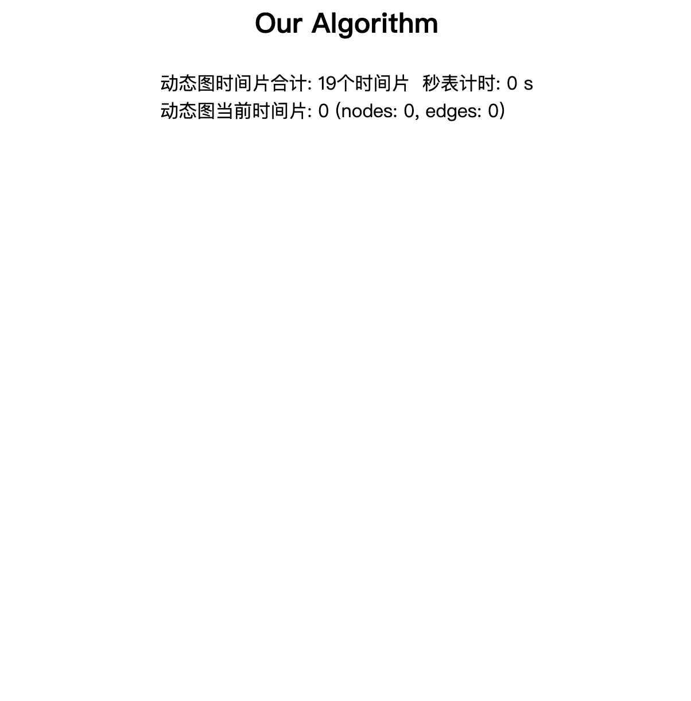


# 具体使用

## Experiment视图怎么切换算法

更换传入的算法名称即可，比如更改为compareConfig[0].name或直接输入对应的字符串

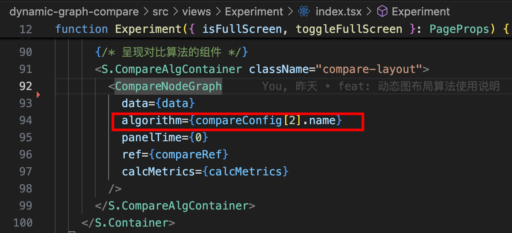

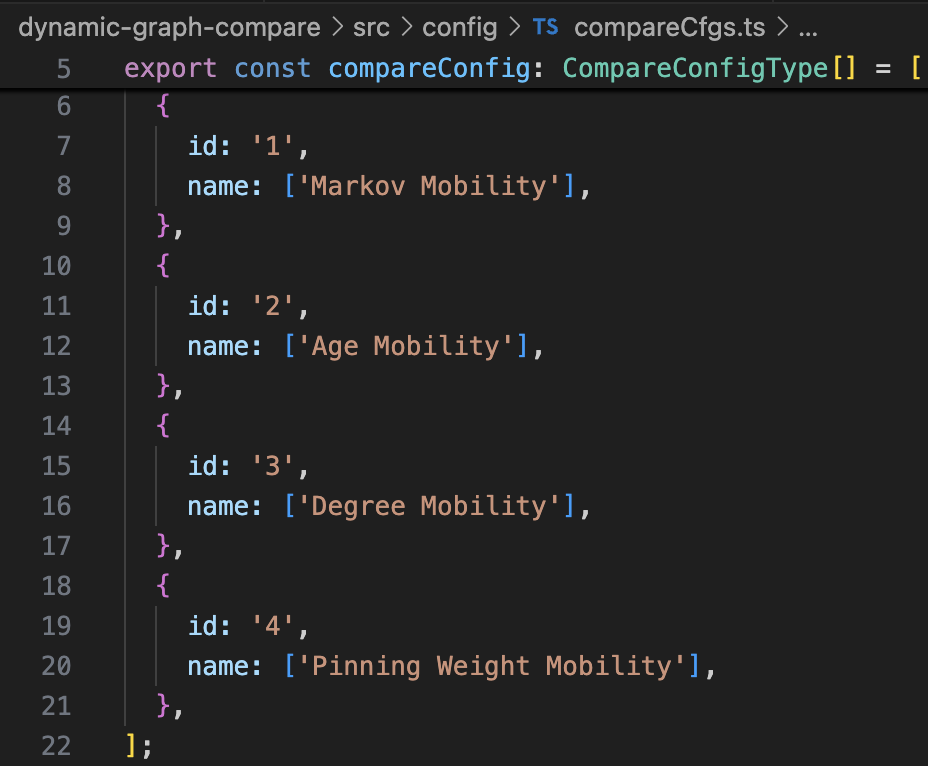

## 怎么一次性呈现某个算法在某个数据集上的运行效果gallery

### 1.运行到某个感兴趣的时间片时，下载已经计算过的时间片的布局结果

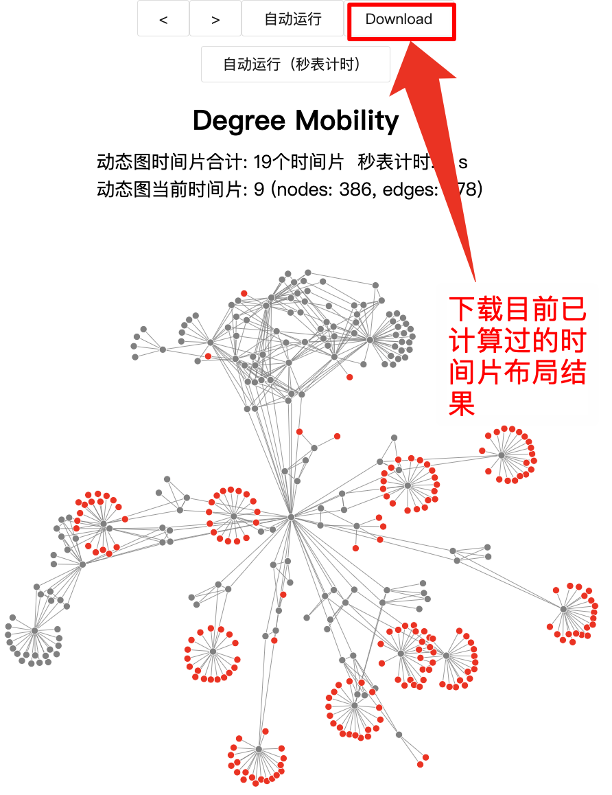


### 2.将下载后的数据根据所用算法和数据集名称放入对应的data/overview文件夹中

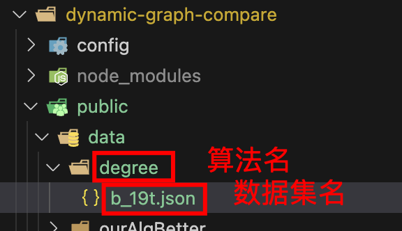

### 3.修改Overview中读取的数据路径

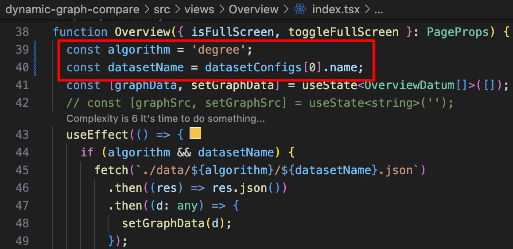

### 4.浏览器输入http://localhost:3000/overview查看gallery

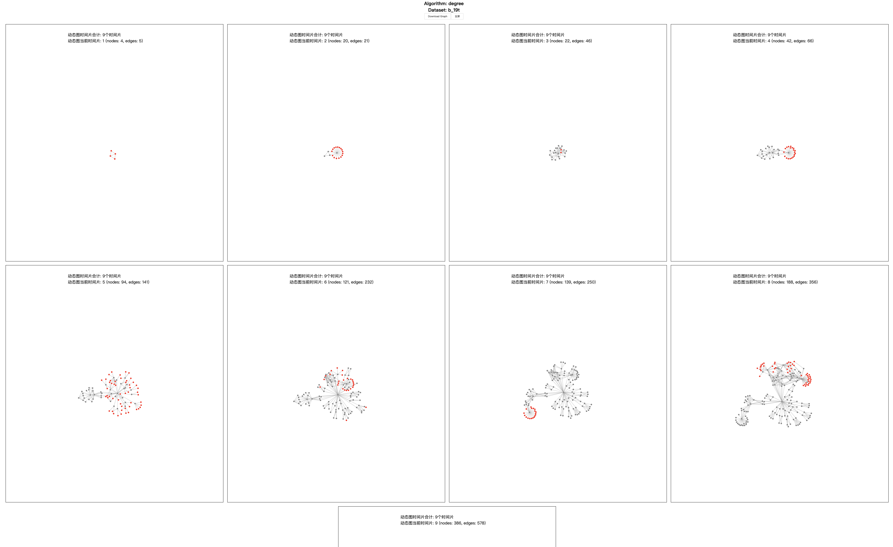

### 5.下载gallery整图


# 进阶——如何在前端工程内嵌入wasm

## 1.引入编译后的calcNode.wasm文件和胶水文件calcNode.js

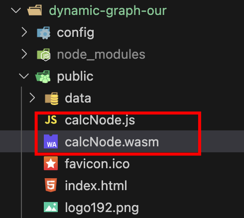

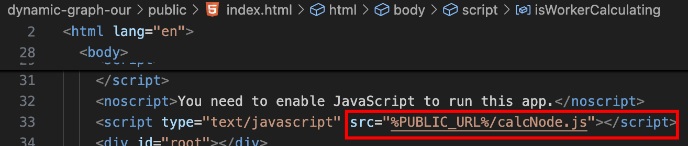

## 2.定义worker线程执行wasm

需要下列步骤：

1. 根据需要定义变量存储数据，并初始处理
2. 定义用于通信的变量，需要用特殊数据类型如Float32Array
3. 为上述定义的用于通信的变量，分配内存
4. 运行引入的js胶水文件内的函数，如calcPosition
5. 释放变量内存
6. 接收wasm计算结果并通过postMessage传递给主线程

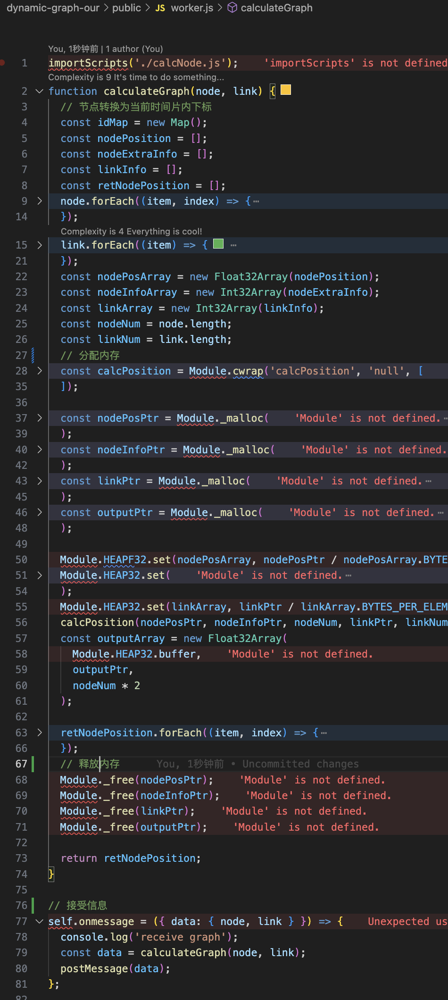


## 3.主线程异步接收子线程返回的数据，并抛出Promise

```
import { LinkInfo, NodeInfo, NodePosition } from '../algorithm/types';
localStorage.setItem('isWorkerCalculating', 'no');

const worker: Worker = new Worker('./worker.js');
function calcNodeWithWorker() {
  let resolver: (result: NodePosition[]) => void;

  worker.onmessage = ({ data }): void => {
    resolver(data);
  };

  return (graphInfo: { node: NodeInfo[]; link: LinkInfo[] }) =>
    new Promise((resolve: (value: NodePosition[]) => void): void => {
      resolver = resolve;
      worker.postMessage(graphInfo);
    });
}

export default calcNodeWithWorker();
```

## 4.封装主线程内异步返回数据的promise

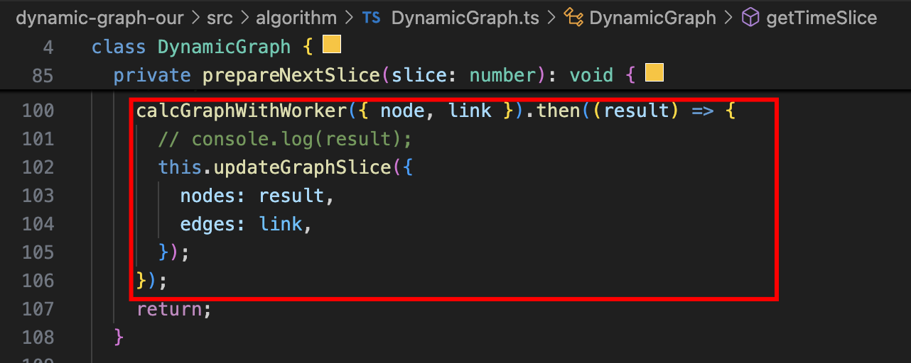
