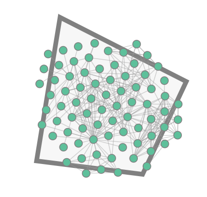
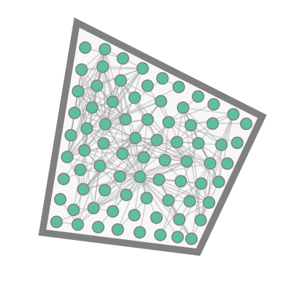
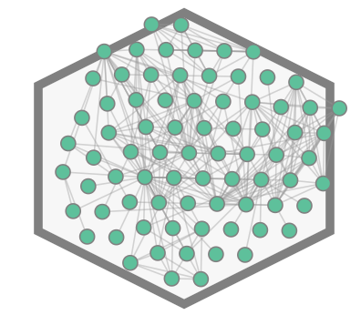
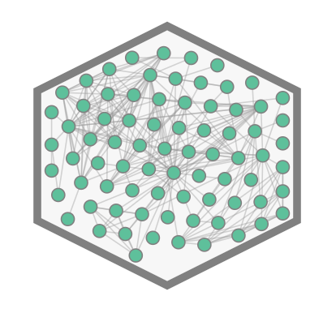
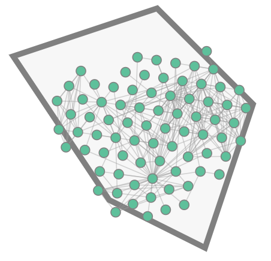
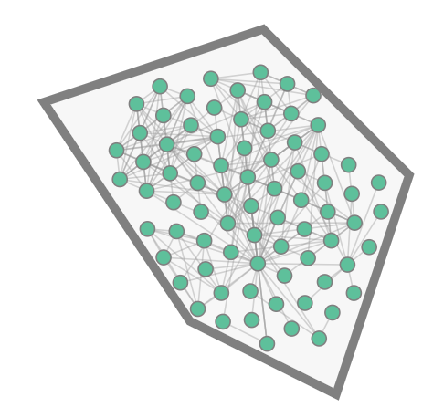

# 场景

将任意网络数据以力导引布局作为基本布局，限制性地布局在给定的任意凸多边形内，边界清晰美观

# 科学问题


# 架构

```
├── data 数据
├── index.html 主页面与逻辑
└── src
    ├── calculatePolygonCentroid.js 
    └── polygonForceConstraint.js
```

# 运行

vscode安装live server插件，开启本地开发服务即可（也可使用其他方法开启本地服务器如python http模块）


# 步骤说明

1. 输入图数据，即具有唯一id标识的nodes和links
2. 输入多边形顶点数据
3. 计算多边形质心
4. 开启力导引模拟器
5. 每次布局迭代时进行多边形限制的力导引计算
6. （可选）拖拽交互
7. （可选）样式配置
8. 渲染多边形与节点链接图

# 算法使用前后的对比效果

## 1.四边形

```
      let polygon = [
        [800.5199476556365, 460.74438869020344],
        [663.4940667427518, 443.50564666079856],
        [693.8467788929881, 258.61407502480455],
        [856.9659737635482, 341.2507784190612],
        [800.5199476556365, 460.74438869020344],
      ];
```



## 2.正六边形

```
      let polygon = [
        [500, 100],
        [600, 150],
        [600, 250],
        [500, 300],
        [400, 250],
        [400, 150],
        [500, 100], // 为了闭合图形，最后一个点和第一个点重复
      ];
```



## 3.不规则五边形

```
      let polygon = [
        [300, 100],
        [450, 50],
        [550, 150],
        [500, 300],
        [400, 250],
        [300, 100], // 为了闭合图形，最后一个点和第一个点重复
      ];
```




