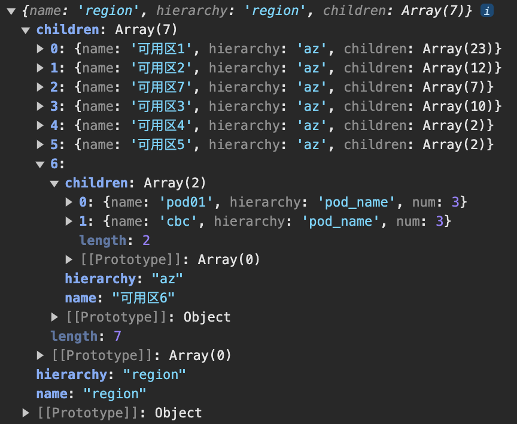
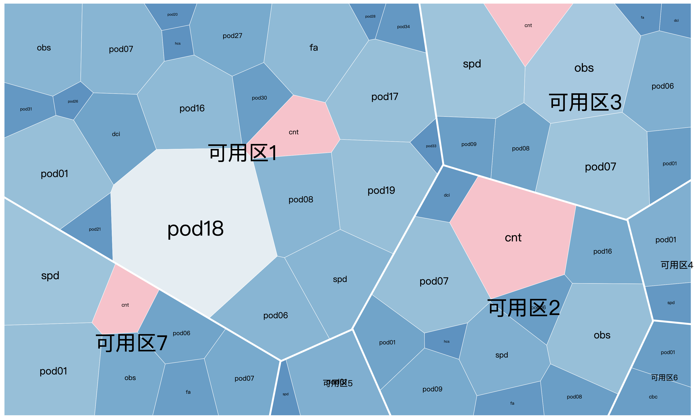
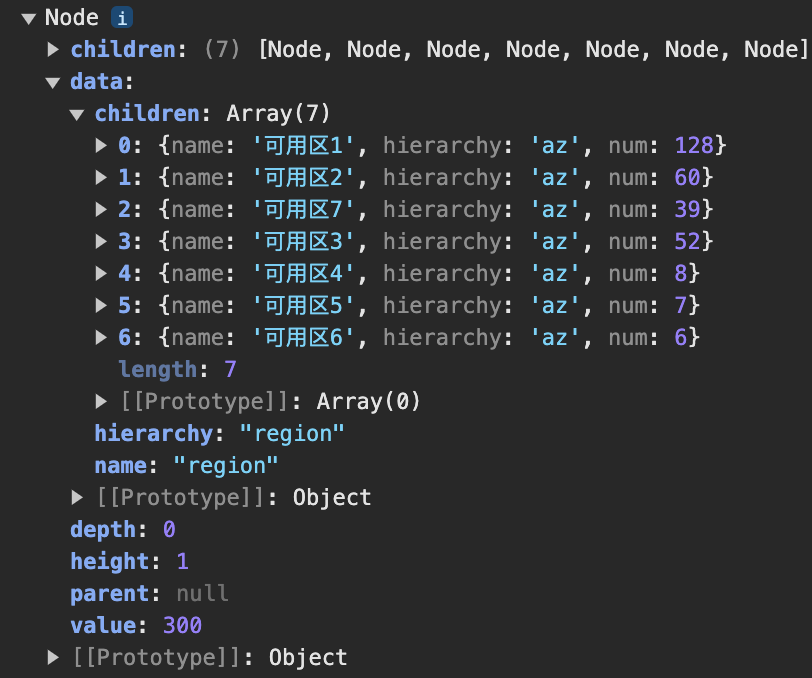

# 场景

将任意权重的树形层级结构按照voronoi-treemap分割，并且允许自定义传入需要高亮的特征

# 架构

```
├── data 数据
├── index.html 主页面
├── package.json 依赖信息
└── src
    ├── dataPrehandle.ts 数据处理加工成可以被分割的标准树形结构
    ├── index.ts 逻辑主入口
    ├── interface.ts 标准树形结构约束
    ├── layout 画布分割布局算法
    └── render.ts 渲染多边形及其标签
```

# 运行

要求：node环境

```
npm i -g pnpm
yarn
yarn dev
```

# 步骤说明

1. 将点异质网络数据处理成层级结构

配置项：数据，层级数量，各层级的索引（TODO:连续且正序）和key信息

比如对于3层结构region-az-pod的网络大脑数据，配置如下

```ts
let hierarchalData = InitData(originData, 3, [
  { index: 0, key: 'region' },
  { index: 1, key: 'az' },
  { index: 2, key: 'pod_name' },
]);
```

返回层级数据结构符合`BoneStructure`且只有最底层的叶子节点结构为`BottomStructure`

```ts
// 层级结构基本信息
export interface LevelStructure {
  name: string;
  hierarchy: string;
}
// 非底层结构
export interface BoneStructure extends LevelStructure {
  children: BoneStructure[] | BottomStructure[];
}
// 底层结构
export interface BottomStructure extends LevelStructure {
  num: number;
  [key: string]: any;
}

```

2. 统计树形结构各层级权重

3. 定义矩形边界几何信息

4. 设置每个数据集的标识符，保证分割结果一致

5. 根据树形结构分割画布，并将特殊pod中心化

6. （可选）设置分割区域根据权重设置颜色插值范围

7. 渲染各多边形区域及其标签

# 效果

## 3层 Region-AZ-POD

### 层级业务信息配置

```ts
  let hierarchalData = InitData(originData, 3, [
    { index: 0, key: 'region' },
    { index: 1, key: 'az' },
    { index: 2, key: 'pod_name' },
  ]);	
```

### 层级数据



### 渲染结果



## 2层 Region-AZ

### 层级业务信息配置

```ts
  let hierarchalData = InitData(originData, 2, [
    { index: 0, key: 'region' },
    { index: 1, key: 'az' },
  ]);
```

### 层级数据



### 渲染结果